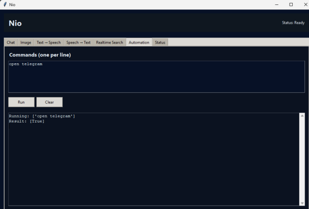
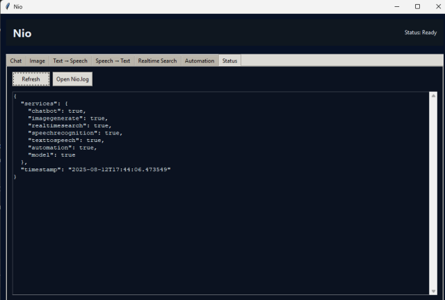

# 🤖 Nio AI Assistant

**Nio AI Assistant** is an advanced, AI-powered virtual assistant designed to facilitate seamless human-computer interaction through both **voice** and **text** modalities.  

Built with modularity and extensibility in mind, Nio integrates multiple AI technologies including **natural language processing**, **speech recognition**, **text-to-speech**, **image generation**, **automation**, and **real-time information retrieval**.

The assistant operates through an **intuitive graphical user interface** developed in Python’s **Tkinter** framework, enhanced with **animations** and **dynamic status monitoring** to deliver a highly interactive and user-friendly experience.  

With a professional interface and integration of AI models for accurate information retrieval, Nio delivers a **fast, intelligent, and user-friendly virtual assistant experience**.

---

## ✨ Key Features
- 🎙️ **Voice Recognition** — Real-time microphone ON/OFF toggle for instant voice command execution.  
- ⚙️ **Automation** — Executes voice/text commands for app launching, website access, and workflow automation.  
- 💬 **Chat Interface** — Interactive chat view with persistent message logging.  
- 🔄 **Dynamic Data Handling** — Instant updates for microphone status, AI responses, and assistant feedback.  
- 🧩 **Modular Architecture** — Scalable design for effortless integration of future AI tools and services.  
- 🖼️ **Image Generation** — Dedicated section for AI-driven image creation.  
- 📊 **Status Monitoring** — Live tracking of assistant activity with real-time timers.  
- 🔍 **Real-Time Search** — Instant information retrieval directly from the assistant.  

---

## 📸 Screenshots

### 1. Chatting with the AI Assistant  

---

### 2. Generating Images using the AI Assistant  

---

### 3. Text to Speech Conversion  

---

### 4. Speech to Text  

---

### 5. Automation — Automatically Opening Applications  

---

### 6. Status Monitoring of the AI Assistant  

---

### 7. Real-Time Search  

---

## 🚀 About
Nio AI Assistant is designed as a **smart, extensible framework** that combines powerful AI capabilities with an elegant user interface, making advanced human-computer interaction both practical and enjoyable.
